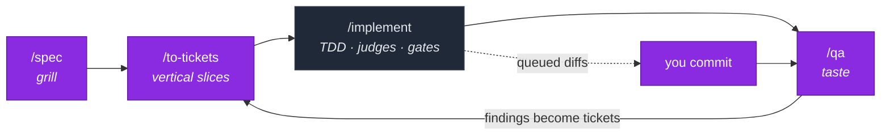
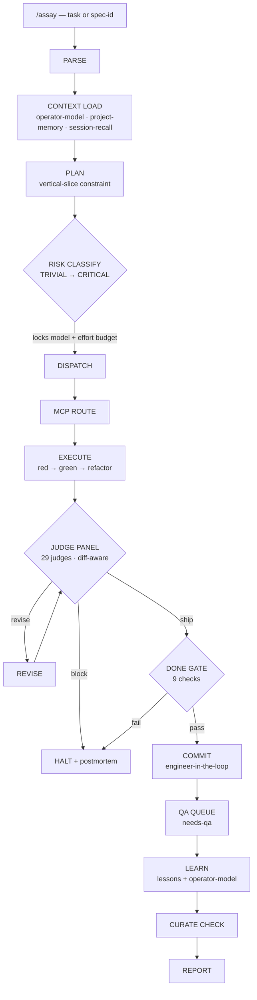

# Assay

[](https://github.com/shadybad/assay/actions/workflows/ci.yml)
[](./LICENSE)
[](./.python-version)
[](https://claude.ai/code)

Assay — a delivery lifecycle that assays AI-generated code before it merges. Grill → PRD → vertical slices → TDD execution → 29-judge panel → done-gate → engineer-in-the-loop commit → hands-on QA → captured lessons.

> Status: v0.1.1 — extracted from a personal config and hardened with a structure test suite + CI. Works as-is. Names and project namespaces are pre-set for the original author; see [CONFIG.md](./CONFIG.md) to personalize.

## Why

Agentic coding fails in predictable ways: shipping the wrong thing well, writing the implementation first and then a test shaped to agree with it, building layer by layer so nothing is integrated until the last step, skipping review on "small" changes, and learning nothing from failures.

Assay is the guardrail layer. It splits the work the way it actually divides — the parts where your judgment is the input (scoping, slicing, hands-on QA) and the parts a machine should grind through (TDD cycles, judges, gates) — and refuses to let the second kind quietly become the first.

Two ideas do most of the work:

- **A test that has never failed has never been proven to test anything.** So the red run is captured, inspected, and checked before any implementation edit.
- **An agent's ceiling is the quality of your feedback loops, not the length of your prompt.** So when a cycle stalls twice, the pipeline asks which loop is inadequate instead of writing more words at the model.

It's also a working reference for several patterns from Anthropic's [multi-agent research system](https://www.anthropic.com/engineering/built-multi-agent-research-system): per-tier effort budgets, structured delegation briefs, an artifact-reference protocol, and long-horizon hand-off.

## The loop

Four commands, in order. The two ends are yours; the middle runs itself.



Calling `/assay "<task>"` directly still works, and on a MEDIUM+ task with no observable outcome or nameable seam it will recommend `/spec` first — because otherwise done-gate asks you to state success criteria *after* the code exists, which is the one moment you're guaranteed to agree with whatever got built. `proceed` is one word away; `--no-spec` skips the gate outright. Both choices are logged.

**`/spec`** grills you one question at a time — minimum eight, each with a recommended answer you accept with `y` — until both mental models agree. It pushes on retroactivity, migration, 3am failure, reversal, and every unpinned number, then writes a PRD with pinned implementation choices and named testing seams.

**`/to-tickets`** cuts it into thin vertical slices. Each crosses every layer it touches, so integration is proven at the first commit rather than the last. A set with a ticket titled after a layer gets discarded and re-sliced, loudly. Tickets carry a `blocked_by` DAG, which is what makes parallel branches safe.

**`/implement`** walks the DAG and runs a full `/assay` on each unblocked ticket — red-green cycles, judges, nine gate checks — then **stops before committing** and queues the diff. Throughput moves; commit authority does not.

**`/qa`** hands you run instructions and goes quiet. What you notice becomes new tickets, never a fix in that session — that context is the far end of a long run, and a fix applied there is the only unreviewed code in the system.

## Architecture

`/assay` is the conductor for one slice. Every step delegates to a skill; the skills compose into one pipeline with two feedback loops (judge → revise, and commit → learn).



Risk tier is the central lever: it locks the model each subagent and judge runs on (Haiku → Sonnet → Opus), caps the effort budget, selects which judges fire, and sets whether the TDD gate bites. A diff-aware pre-pass narrows the judge set to the concern categories the diff actually touches.

Every judge runs in a fresh context and answers on two axes — **standards** (does this meet the bar) and **spec** (does it do what the ticket said, and nothing the non-goals excluded). A standards-clean diff that solves a slightly different problem does not ship.

## Demo

Assay validates its own structure — the walkthrough below runs the real test + lint suite green. Generate it locally with `vhs demo/demo.tape` (see [demo/](./demo/README.md)).

<!-- Uncomment once demo/assay.gif is recorded (run: vhs demo/demo.tape): -->
<!--  -->


## What you get

**13 commands** (`/assay` has four forms)

| Command | What it does |
|---------|--------------|
| `/assay "<task>"` | 14-step orchestrator: parse → context → plan → risk → dispatch → MCP route → execute → judges → revise → done-gate → commit → learn → curate → report. |
| `/assay <spec-id>` | Consume an approved spec from `/spec`. |
| `/assay <ticket-id>` | Execute one vertical slice. Tier, seam, and acceptance criteria pre-loaded. |
| `/assay resume` | Resume the last interrupted /assay session. |
| `/spec` | Grill a fuzzy goal into a spec with pinned choices and named seams (draft → approved → shipped). |
| `/to-tickets` | Slice a spec into vertical tickets with a `blocked_by` DAG. |
| `/implement` | Work the board: full pipelines back to back, queued for your commit. |
| `/qa` | Hands-on pass. Findings become tickets, never fixes. |
| `/context` | Ubiquitous-language glossary + ADRs. Loaded on every run. |
| `/architecture` | Find shallow coupled clusters, propose deep modules. Proposal-only. |
| `/postmortem` | Failure-side learning loop. Auto-fires on `/assay` halt. |
| `/morning` | Daily kickoff brief (read-only). |
| `/eod` | End-of-day wrap (gated writes). |
| `/weekly` | Sunday review + cross-project pattern detection. |
| `/cross-learn` | Promote patterns learned in one project namespace into system-level rules. |
| `/assay-stats` | Is the pipeline earning its cost? Stage fire rates, per-judge acceptance, edit-after-review, first-pass approval — each with a kill threshold and an honest sample size. |

**17 skills** (orchestrated by the commands above)

`spec-builder`, `ticket-board`, `tdd-loop`, `qa-queue`, `context-glossary`, `architecture-scan`, `judge-panel`, `done-gate`, `commit-protocol`, `project-memory`, `session-recall`, `operator-model`, `mcp-router`, `notion-bridge`, `skill-curator`, `postmortem`, `plugin-packager`.

**3 hooks** (proposal surfacing — see [hooks/README.md](./hooks/README.md))

`proposal-watcher.sh` (SessionStart banner), `composed-statusline.sh` (📋 N indicator), `proposal-count.sh` (helper). Surfaces pending skill-curator proposals on session start and in the statusline.

## Tested

Assay is markdown that instructs a model, so its compile errors are dangling references — a step citing a renumbered gate check, a command naming a skill that isn't there, a delegation to an uninstalled plugin. None of those fail at runtime; they quietly degrade into the model improvising.

A pytest suite runs in CI to fail the build instead: manifest integrity, skill/command frontmatter, the judge-panel roster count, config-key documentation, lifecycle completeness, dead-plugin references, doc-link resolution, and hook executability.

```bash
uv sync && uv run pytest
```

See [CONTRIBUTING.md](./CONTRIBUTING.md) for what each test enforces.

## Install

### Option A — local plugin (immediate)

```bash
git clone https://github.com/shadybad/assay.git ~/.claude/plugins/local/assay
```

Or symlink from anywhere:

```bash
git clone https://github.com/shadybad/assay.git ~/repos/assay
mkdir -p ~/.claude/plugins/local
ln -s ~/repos/assay ~/.claude/plugins/local/assay
```

Restart Claude Code. `/assay` should now be available.

### Option B — drop directly into `~/.claude/`

If you don't want the plugin layer:

```bash
git clone https://github.com/shadybad/assay.git /tmp/assay
cp -i /tmp/assay/.claude/commands/*.md ~/.claude/commands/
cp -ri /tmp/assay/.claude/skills/* ~/.claude/skills/
```

See [INSTALL.md](./INSTALL.md) for the full options matrix.

## Configure

Where tickets live, what the glossary is called, and how hard the TDD gate bites are per-install choices, kept outside the repo so a `git pull` never stomps them:

```bash
./scripts/assay_config.py --init   # ~/.claude/assay.config.json, shipped defaults
./scripts/assay_config.py --show
```

```json
{
  "tickets":  { "backend": "repo-files", "path": "docs/tickets" },
  "glossary": { "path": "CONTEXT.md", "adr_path": "docs/adr" },
  "tdd":      { "min_tier": "MEDIUM" },
  "qa":       { "queue": true }
}
```

Missing file, missing key, and malformed JSON all fall back to defaults per key — a fresh install works with no config at all. Full key reference in [CONFIG.md](./CONFIG.md).

## Personalize

The skills reference the original author's name and project namespaces (`auto-co`, `margin-invest`, `personal`). To swap them for your own:

```bash
./scripts/personalize.sh "<your-name>" "<project-1>" "<project-2>"
```

See [CONFIG.md](./CONFIG.md) for what gets rewritten and why.

## Dependencies

**None required.** Planning, subagent dispatch, and every judge run on built-in Claude Code capability — the `Plan` and `Explore` agents, the Agent tool, and the `code-review` / `security-review` skills.

Optional, and named explicitly where they're used:

- `claude-plugins-official` (`plugin-dev`, `commit-commands`, `hookify`, `pyright-lsp`, `notion`, `github`)
- `caveman` marketplace (token compression)
- `superpowers` marketplace (`episodic-memory` and `private-journal-mcp` back the memory skills' richer modes; they degrade to file-based search without them)

## License

MIT — see [LICENSE](./LICENSE).
